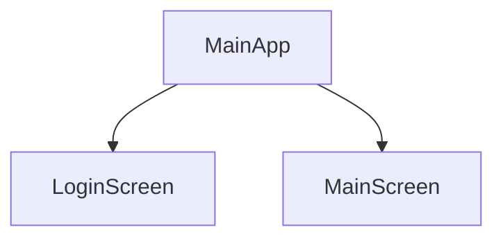

# Navegación

Status: Done
🪴 Units: Sin título (https://www.notion.so/36c86319a6574ff9ab8b500927150257?pvs=21)

Uno de los aspectos básicos en cualquier aplicación es la posibilidad de tener más de una pantalla que permita realizar una navegación entre diferentes pantallas tras la pulsación de un botón o cualquier acción. Hasta este momento lo que se ha visto es como poder crear un widget general que representa la pantalla y dentro de éste la organización de diferentes tipos de elementos. Sin embargo, con una sola pantalla estamos reduciendo en gran medida las posibilidades a la hora de darle funcionalidad a nuestra aplicación, ya que tan solo contaremos con un marco o pantalla para incluir elementos, lo que limita mucho al programador.

Para poder realizar una navegación lo que necesitamos es de dos clases que representen dos pantallas (por lo general la pantalla será stateless), las cuales están creadas mediante dos clases las cuales pueden o no estar en el mismo fichero. En este ejemplo crearemos dos pantallas simulando un login, donde en la primera pantalla se mostrará el típico login con campos de nombre y contraseña además de un botón y en el caso de realizarlo de forma correcta, mostrará una segunda pantalla con una lista de usuarios. Para ello crearemos dos ficheros llamados loginScreen y MainScreen

## LoginScreen

Representa una pantalla donde lo que se quiere guardar son los elementos que están dentro de los campos de texto que se puede introducir. Para ello se utiliza un dos TextFields a los cuales se les asocia un controlador que gestiona su estado. Recordad que para poder guardar datos, es necesario el uso del Statefull, sino esto no sería posible

```java
import 'package:flutter/material.dart';

class MyLoginPage extends StatefulWidget {
  final String title;

  MyLoginPage(this.title);

  @override
  State<MyLoginPage> createState() {
    return _MyLoginPageState();
  }
}

class _MyLoginPageState extends State<MyLoginPage> {
  final TextEditingController _controllerMail = TextEditingController();
  final TextEditingController _controllerPass = TextEditingController();

  @override
  Widget build(BuildContext context) {
    return Scaffold(
      appBar: AppBar(title: Text(widget.title)),
      body: Container(
        padding: EdgeInsets.all(30.0),
        child: Center(
          child: Column(
            mainAxisAlignment: MainAxisAlignment.center,
            crossAxisAlignment: CrossAxisAlignment.center,
            children: [
              TextField(controller: _controllerMail),
              Padding(padding: EdgeInsets.only(bottom: 20)), // Aplica margen solo al final
              TextField(controller: _controllerPass),
              Padding(padding: EdgeInsets.only(bottom: 50)), // Aplica margen solo al final
              ElevatedButton(onPressed: (){}, child: Text("Login"))
            ],
          ),
        ),
      ),
      floatingActionButton: IconButton(
        onPressed: () {},
        icon: Icon(Icons.login),
      ),
    );
  }
}
```

Para comprobar la funcionalidad del formulario, podemos obtener una barra de notificación con la pulsación del boton login, así como el vaciado de los campos Textfiel con la pulsacion del floating  ActionButton de la pantalla

```java
  mostarSnackBar(){
    var snackBar = SnackBar(content: Text('Intento de login con ${_controllerMail.text} ${_controllerPass.text} '));
    ScaffoldMessenger.of(context).showSnackBar(snackBar);
  }

  limpiarCampos(){
    _controllerMail.clear();
    _controllerPass.clear();
  }
```

Estos métodos serán llamados desde la pulsación de ambos botones:

```java
 ElevatedButton(onPressed: (){
                mostarSnackBar("correo", "pass");
              }, child: Text("Login"))
              
onPressed: () {
          limpiarCampos();
        },
```

## MainScreen

La pantalla prncipal será la que sea navegada tras la pulsación del botón de login. En este caso la composición será muy simple, tan solo mostrando un texto (donde se pondrá el correo recibido). Al no querer utilizar ni guardar datos, se trata de un widget de tipo stateless

```java
import 'package:flutter/material.dart';

class MainPage extends StatelessWidget {
  final String title;

  const MainPage(this.title);

  @override
  Widget build(BuildContext context) {
    // TODO: implement build
    return Scaffold(
      appBar: AppBar(title: Text(this.title)),
      body: Center(
        child: Column(
          mainAxisAlignment: MainAxisAlignment.center,
          crossAxisAlignment: CrossAxisAlignment.center,
          children: [Text("Texto")],
        ),
      ),
      floatingActionButton: FloatingActionButton(
        onPressed: () {},
        child: Text("Volver"),
      ),
    );
  }
}

```

# Navegar

Una vez se tienen las dos páginas, el esquema de la aplicacion ahora mismo debería ser el siguiente:



En este diagrama se puede ver como la aplicación principal (MainApp) tiene dos pantallas hijas: LoginScreen y MainScreen, las cuales serán navegadas según las acciones del usuario.

Lo siguiente que haremos, es que al pulsar el botón login situado en la LoginScren, navegaremos a la MainScreen. Para ello se utiliza la característica Navigator.push

```java
Navigator.push(
      context,
      MaterialPageRoute(builder: (context) => MainPage()),
    );
```

Este Navigator permite cambiar de Widget completo (Scaffold). Mediente el método push, se puede indicar el contexto, y la navegación a realizar, indicando cual es el. Widget que quieres representar de nuevas. 

Otra forma de realizar navegaciones es utilizar rutass nombradas y definidas. Para ello es necesario definirlas dentro del elemento común, en nuestro caso MainApp, indicando en el componente MaterialApp los siguientes datos:

```java
initialRoute: '/', // Ruta inicial
        routes: {
          '/': (context) => MyLoginPage("Login App"),
          '/main': (context) => (MainPage()),
        },
```

Para poder utilizarlo en la navegación, se sustituiría el método push por el pushNamed